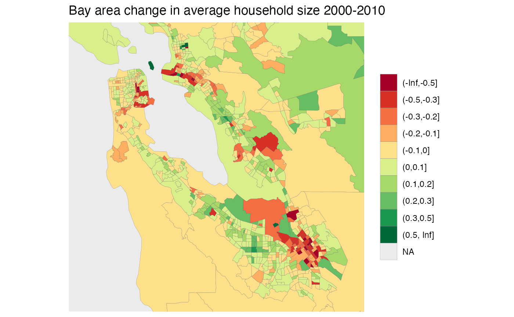

# TongFen for US census data

``` r

library(tongfen)
library(dplyr)
library(ggplot2)
#library(mountainmathHelpers)
```

As an example we will explore changing household size between the 2000
and 2010 US census. First we need to build the metadata for our
variables “H011001” for *population* and “H013001” for *households*.

``` r

variables=c(population="H011001",households="H013001")

meta <- c(2000,2010) %>%
  lapply(function(year){
      v <- variables %>% setNames(paste0(names(.),"_",year))
      meta_for_additive_variables(paste0("dec",year),v)
    }) %>%
  bind_rows()
meta
#> # A tibble: 4 × 8
#>   variable dataset label           type   aggregation rule    geo_dataset parent
#>   <chr>    <chr>   <chr>           <chr>  <chr>       <chr>   <chr>       <lgl> 
#> 1 H011001  dec2000 population_2000 Manual Additive    Additi… dec2000     NA    
#> 2 H013001  dec2000 households_2000 Manual Additive    Additi… dec2000     NA    
#> 3 H011001  dec2010 population_2010 Manual Additive    Additi… dec2010     NA    
#> 4 H013001  dec2010 households_2010 Manual Additive    Additi… dec2010     NA
```

Armed with that we can call `get_tongfen_us_census` to request the data
on a common geography based on census tracts and compute the change in
household size.

``` r

census_data <- get_tongfen_us_census(regions = list(state="CA"), meta=meta, level="tract") %>%
  mutate(change=population_2010/households_2010-population_2000/households_2000) 
```

``` r

census_data %>% names()
#> [1] "TongfenID"       "TongfenUID"      "geometry"        "population_2000"
#> [5] "households_2000" "population_2010" "households_2010" "change"
```

We bin the data for better plotting and zoom in on the Bay area.

``` r

census_data %>%
  mutate(c=cut(change,c(-Inf,-0.5,-0.3,-0.2,-0.1,0,0.1,0.2,0.3,0.5,Inf))) %>%
  ggplot() +
  geom_sf(aes(fill=c), size=0.05) +
  scale_fill_brewer(palette = "RdYlGn") +
  labs(title="Bay area change in average household size 2000-2010", fill=NULL) +
  #geom_water() + geom_roads() +
  coord_sf(datum=NA,xlim=c(-122.6,-121.7),ylim=c(37.2,37.9))
```


