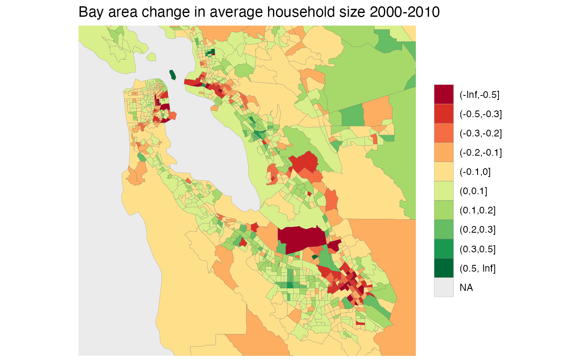
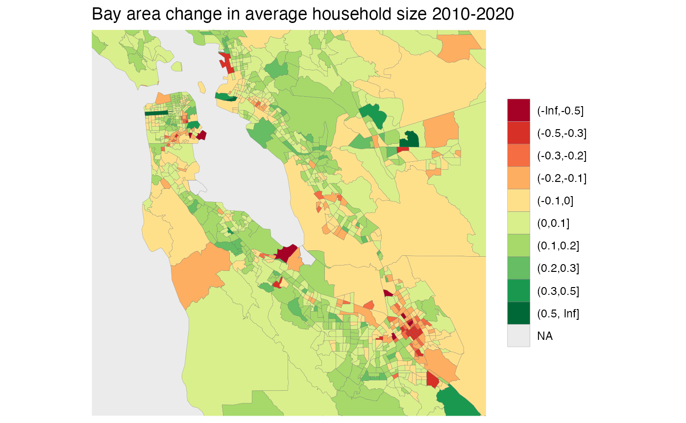

# TongFen for US census data

``` r

library(tongfen)
library(dplyr)
library(ggplot2)
#library(mountainmathHelpers)
```

As an example we will explore changing household size between the 2000
and 2010 US census. First we need to build the metadata for our
variables “H011001” for *population* and “H013001” for *households*.

``` r

variables=c(population="H011001",households="H013001")

meta <- c(2000,2010) %>%
  lapply(function(year){
      v <- variables %>% setNames(paste0(names(.),"_",year))
      meta_for_additive_variables(paste0("dec",year),v)
    }) %>%
  bind_rows()
meta
#> # A tibble: 4 × 8
#>   variable dataset label           type   aggregation rule    geo_dataset parent
#>   <chr>    <chr>   <chr>           <chr>  <chr>       <chr>   <chr>       <lgl> 
#> 1 H011001  dec2000 population_2000 Manual Additive    Additi… dec2000     NA    
#> 2 H013001  dec2000 households_2000 Manual Additive    Additi… dec2000     NA    
#> 3 H011001  dec2010 population_2010 Manual Additive    Additi… dec2010     NA    
#> 4 H013001  dec2010 households_2010 Manual Additive    Additi… dec2010     NA
```

Armed with that we can call `get_tongfen_us_census` to request the data
on a common geography based on census tracts and compute the change in
household size.

``` r

census_data <- get_tongfen_us_census(regions = list(state="CA"), meta=meta, level="tract") %>%
  mutate(change=population_2010/households_2010-population_2000/households_2000) 
```

``` r

census_data %>% names()
#> [1] "TongfenID"       "TongfenUID"      "geometry"        "population_2000"
#> [5] "households_2000" "population_2010" "households_2010" "change"
```

We bin the data for better plotting and zoom in on the Bay area.

``` r

census_data %>%
  mutate(c=cut(change,c(-Inf,-0.5,-0.3,-0.2,-0.1,0,0.1,0.2,0.3,0.5,Inf))) %>%
  ggplot() +
  geom_sf(aes(fill=c), size=0.05) +
  scale_fill_brewer(palette = "RdYlGn") +
  labs(title="Bay area change in average household size 2000-2010", fill=NULL) +
  #geom_water() + geom_roads() +
  coord_sf(datum=NA,xlim=c(-122.6,-121.7),ylim=c(37.2,37.9))
```



## Bridging to the 2020 census

The same works across the 2010 and 2020 censuses. Two things change. The
2020 census renamed the variables, *population in occupied housing
units* is `H8_001N` and *households* is `H3_002N`. And those live in the
Demographic and Housing Characteristics file, whereas tidycensus reads
the PL 94-171 redistricting file for 2020 by default, so we point it at
the right one via `sumfile`. It takes a single value for all censuses,
or one named by dataset as we do here.

``` r

meta_2020 <- bind_rows(
  meta_for_additive_variables("dec2010",c(population_2010="H011001",
                                          households_2010="H013001")),
  meta_for_additive_variables("dec2020",c(population_2020="H8_001N",
                                          households_2020="H3_002N")))
```

``` r

census_data_2020 <- get_tongfen_us_census(regions = list(state="CA"), meta=meta_2020,
                                          level="tract", sumfile=c(dec2020="dhc")) %>%
  mutate(change=population_2020/households_2020-population_2010/households_2010)
```

``` r

census_data_2020 %>%
  mutate(c=cut(change,c(-Inf,-0.5,-0.3,-0.2,-0.1,0,0.1,0.2,0.3,0.5,Inf))) %>%
  ggplot() +
  geom_sf(aes(fill=c), size=0.05) +
  scale_fill_brewer(palette = "RdYlGn") +
  labs(title="Bay area change in average household size 2010-2020", fill=NULL) +
  coord_sf(datum=NA,xlim=c(-122.6,-121.7),ylim=c(37.2,37.9))
```



## Notes on the common geography

The Census Bureau relationship files these correspondences are built
from are geometric overlays, they list every place two censuses’
geographies intersect, including slivers along boundaries that only
shifted by a few metres. Chaining those together merges regions that
have nothing to do with each other, so `min_area_share` sets how much
area two regions have to have in common before they count as related.
The default of `0.01` works well, raising it gives finer common
geographies at the risk of separating regions that genuinely did change.
No region is ever dropped, if all of a region’s parts fall below the
cutoff its largest part is kept.

Correspondence tables reach back one census further than the data does.
The Census Bureau has retired the 1990 API endpoint, so tidycensus
cannot fetch 1990 data, but `get_tongfen_correspondence_us_census` will
match 1990 tracts up with later censuses. To use it, get the 1990 data
elsewhere, for example from NHGIS via the ipumsr package, and hand it to
`tongfen_aggregate` along with the correspondence table.
